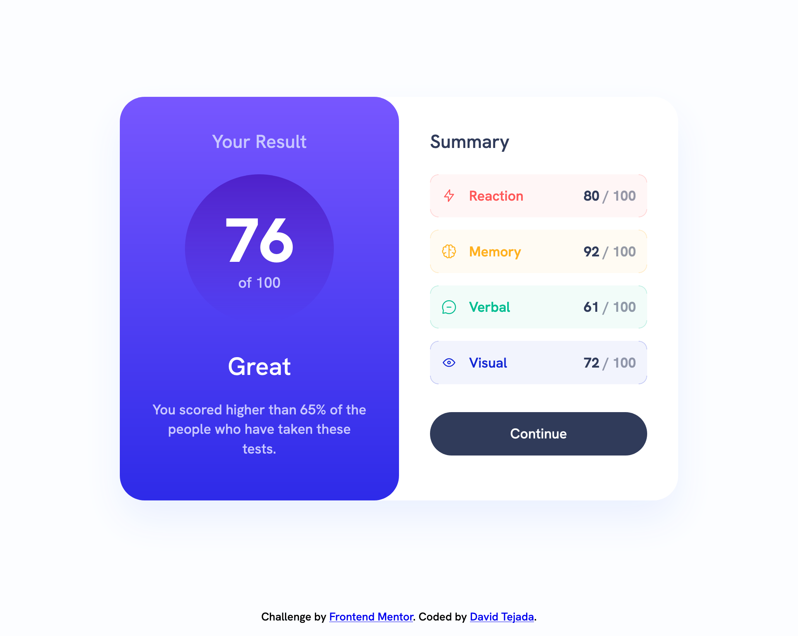

# Frontend Mentor - Results summary component solution

This is a solution to the [Results summary component challenge on Frontend Mentor](https://www.frontendmentor.io/challenges/results-summary-component-CE_K6s0maV). Frontend Mentor challenges help you improve your coding skills by building realistic projects.

## Table of contents

- [Overview](#overview)
  - [The challenge](#the-challenge)
  - [Screenshot](#screenshot)
  - [Links](#links)
- [My process](#my-process)
  - [Built with](#built-with)
  - [What I learned](#what-i-learned)
  - [Continued development](#continued-development)
  - [Useful resources](#useful-resources)
- [Author](#author)
- [Acknowledgments](#acknowledgments)

## Overview

### The challenge

Users should be able to:

- View the optimal layout for the interface depending on their device's screen size
- See hover and focus states for all interactive elements on the page

### Screenshots

### Links

- Solution URL: [frontendmentor-challenges/02-results-summary-component](https://github.com/david-tejada/frontendmentor-challenges/tree/main/02-results-summary-component)
- Live Site URL: [Add live site URL here](https://your-live-site-url.com)

## My process

### Built with

- Semantic HTML5 markup
- SASS
- BEM naming convention
- Flexbox
- CSS Grid

### What I learned

Initially, I wanted to just use vanilla CSS but I didn't like how my code was becoming a bit messy. So I decided to try SASS and BEM naming. Since I was adding a build step anyway I decided to include a linter for consistency.

Deciding what would become a block was a bit complicated. I tried to imagine how this component would fit in a larger website, what would become reusable. I decided to make each part of the card its own block `.card` and the entire component `.dual-card`. I figured that would bring more versatility. Similarly I thought that each category box in the summary could be its own block. I thought that block could be used in another part of the application with a slightly different role. I thought about calling it `.label` or `.tag`. Neither of those convinced me as they usually have a different meaning. I ended up using `.stat` inspired by Chakra UI. I'm not entirely convinced anyway but I couldn't think of anything better.

I tried to give a special emphasis to accessibility. There still are some accessibility issues related to text contrast but I don't think there's much that I can do without changing the given design. For example, in the reaction category I would still get a contrast value of 3.11 using white background and the provided light red color.

### Continued development

I liked using SASS and BEM so I'm gonna keep using them and try to get a better feel for how to split components in different blocks. I would also like to learn to use VoiceOver to keep improving on accessibility.

### Useful resources

- [Stat - Chakra UI](https://chakra-ui.com/docs/components/stat)

## Author

- Frontend Mentor - [@david-tejada](https://www.frontendmentor.io/profile/david-tejada)
- Twitter - [@david_tejada](https://www.twitter.com/david_tejada)
