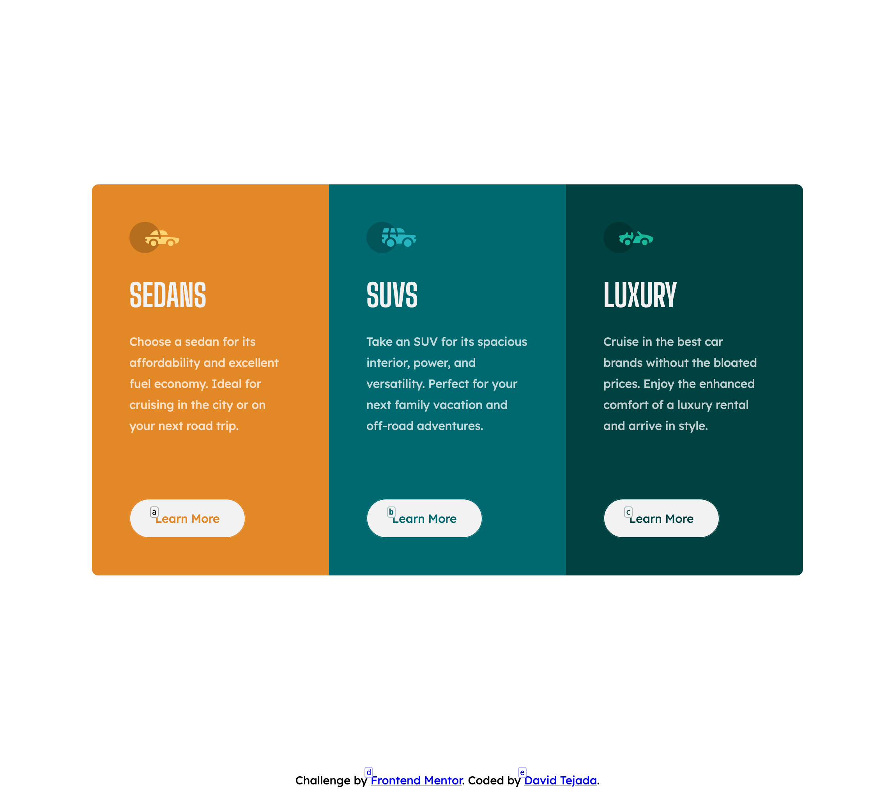
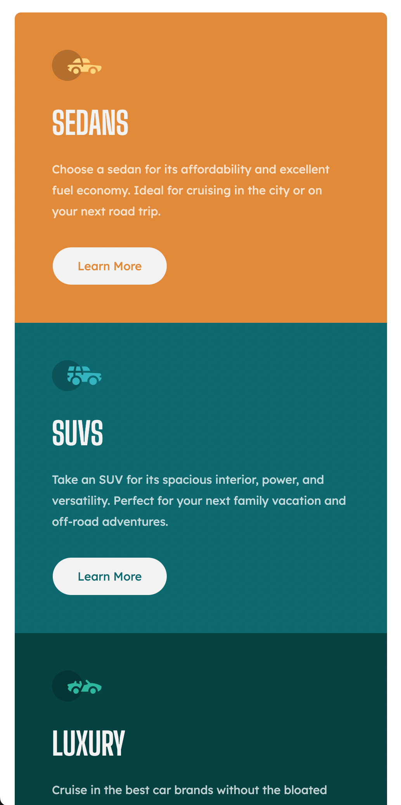

# Frontend Mentor - 3-column preview card component solution

This is a solution to the [3-column preview card component challenge on Frontend Mentor](https://www.frontendmentor.io/challenges/3column-preview-card-component-pH92eAR2-). Frontend Mentor challenges help you improve your coding skills by building realistic projects.

## Table of contents

- [Overview](#overview)
  - [The challenge](#the-challenge)
  - [Screenshots](#screenshots)
  - [Links](#links)
- [My process](#my-process)
  - [Built with](#built-with)
  - [What I learned](#what-i-learned)
- [Author](#author)

**Note: Delete this note and update the table of contents based on what sections you keep.**

## Overview

### The challenge

Users should be able to:

- View the optimal layout depending on their device's screen size
- See hover states for interactive elements

### Screenshots

#### Desktop

#### Mobile

### Links

- Solution URL: [frontendmentor-challenges/03-three-column-preview-card-component](https://github.com/david-tejada/frontendmentor-challenges/tree/main/03-three-column-preview-card-component)
- Live Site URL: [Frontend Mentor | 3-column preview card component](https://aquamarine-kitten-db0203.netlify.app/)

## My process

### Built with

- Semantic HTML5 markup
- SASS
- BEM naming convention
- Flexbox
- CSS Grid
- Transitions

### What I learned

I found placing the button right at the bottom was tricker than expected. At the beginning I just applied bottom margin to the paragraph which looked okay if all the paragraphs had the same height. But the moment one of the paragraphs didn't have the same height as the rest the button wouldn't align with the rest of them. My solution was to make the card a flex container and apply a margin-top of `auto` to the button. I also had to apply `align-self: start;` so that the button wouldn't occupy the whole width.

## Author

- Frontend Mentor - [@david-tejada](https://www.frontendmentor.io/profile/david-tejada)
- Twitter - [@david_tejada](https://www.twitter.com/david_tejada)
