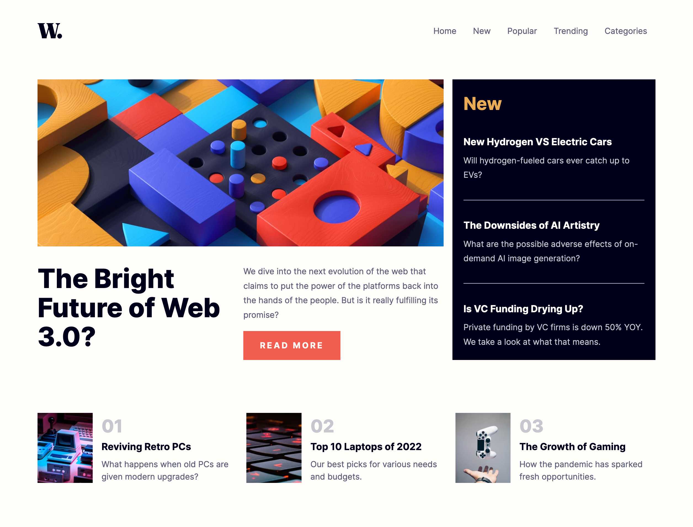

# Frontend Mentor - News homepage solution

This is a solution to the [News homepage challenge on Frontend Mentor](https://www.frontendmentor.io/challenges/news-homepage-H6SWTa1MFl). Frontend Mentor challenges help you improve your coding skills by building realistic projects.

## Table of contents

- [Overview](#overview)
  - [The challenge](#the-challenge)
  - [Screenshot](#screenshot)
  - [Links](#links)
- [My process](#my-process)
  - [Built with](#built-with)
  - [Useful resources](#useful-resources)

## Overview

### The challenge

Users should be able to:

- View the optimal layout for the interface depending on their device's screen size
- See hover and focus states for all interactive elements on the page

### Screenshot

### Links

- Solution URL: [frontendmentor-challenges/15-news-homepage](https://github.com/david-tejada/frontendmentor-challenges/tree/main/15-news-homepage)
- Live Site URL: [Frontend Mentor | News homepage](https://glowing-malasada-643950.netlify.app/)

## My process

### Built with

- Semantic HTML5 markup
- CSS custom properties
- Flexbox
- CSS Grid
- Container queries
- Mobile-first workflow

### Useful resources

- [Let’s Focus on Slide-Out Navigation – Knowbility](https://knowbility.org/blog/2020/accessible-slide-menus)
- [Responsive navbar tutorial using HTML CSS & JS - YouTube](https://www.youtube.com/watch?v=HbBMp6yUXO0&t=2402s)
