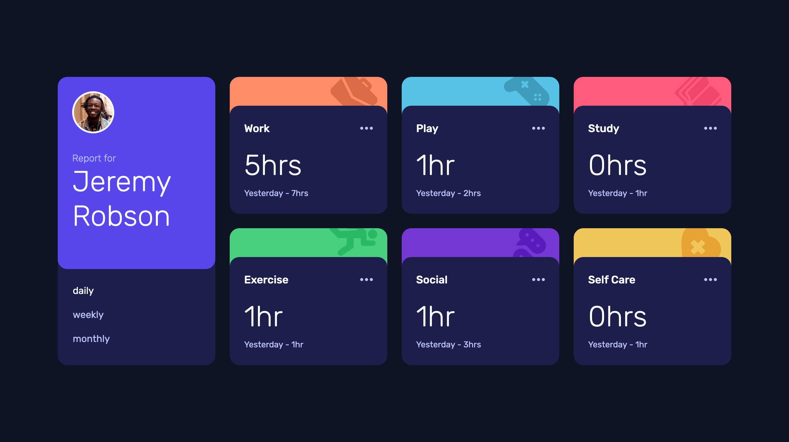

# Frontend Mentor - Time tracking dashboard solution

This is a solution to the [Time tracking dashboard challenge on Frontend Mentor](https://www.frontendmentor.io/challenges/time-tracking-dashboard-UIQ7167Jw). Frontend Mentor challenges help you improve your coding skills by building realistic projects.

## Table of contents

- [Overview](#overview)
  - [The challenge](#the-challenge)
  - [Screenshot](#screenshot)
  - [Links](#links)
- [My process](#my-process)
  - [Built with](#built-with)
  - [What I learned](#what-i-learned)
  - [Useful resources](#useful-resources)

## Overview

### The challenge

Users should be able to:

- View the optimal layout for the site depending on their device's screen size
- See hover states for all interactive elements on the page
- Switch between viewing Daily, Weekly, and Monthly stats

### Screenshot



### Links

- Solution URL: [frontendmentor-challenges/16-time-tracking-dashboard](https://github.com/david-tejada/frontendmentor-challenges/tree/main/16-time-tracking-dashboard)
- Live Site URL: [Add live site URL here](https://your-live-site-url.com)

## My process

### Built with

- Semantic HTML5 markup
- CSS custom properties
- Flexbox
- CSS Grid
- Container queries
- Mobile-first workflow
- [Vite | Next Generation Frontend Tooling](https://vitejs.dev/)
- [React](https://reactjs.org/) - JS library
- [TypeScript](https://www.typescriptlang.org/)
- [CSS Modules](https://github.com/css-modules/css-modules)

### What I learned

One of the challenges was to have the content of the cards being clickable while at the same time containing a button that shouldn't trigger the hover state of the whole card. To me clicking to that area would take you to some page that would contain a breakdown of that category. For that reason I think an anchor would be appropriate. But having a button inside the anchor is not semantically correct. For that reason I decided to make just the title (e.g. Work) an anchor element and make the whole area clickable using [the redundant click event technique](https://inclusive-components.design/cards/).

To avoid the button being hovered triggering the hover styles of the whole card I added `mouseenter` and `mouseleave` events handlers.

```tsx
const handleButtonMouseEnter = () => {
  if (content.current) {
    content.current.style.backgroundColor = "hsl(235 46% 20%)";
  }
};

const handleButtonMouseLeave = () => {
  if (content.current) {
    content.current.removeAttribute("style");
  }
};
```

This could have been solved using the `has` selector but support is not enough at the moment, with it only implemented in Firefox under a flag. Anyway I included the necessary CSS to be able to remove the event listeners once support for `has` is sufficient:

```css
.content:has(button:hover) {
  background-color: var(--color-blue-700);
}
```

### Useful resources

- [Cards](https://inclusive-components.design/cards/)
- [TypeScript: Always use readonly arrays in generic types | Ayub Begimkulov](https://ayubbegimkulov.com/readonly-arrays-ts/)
