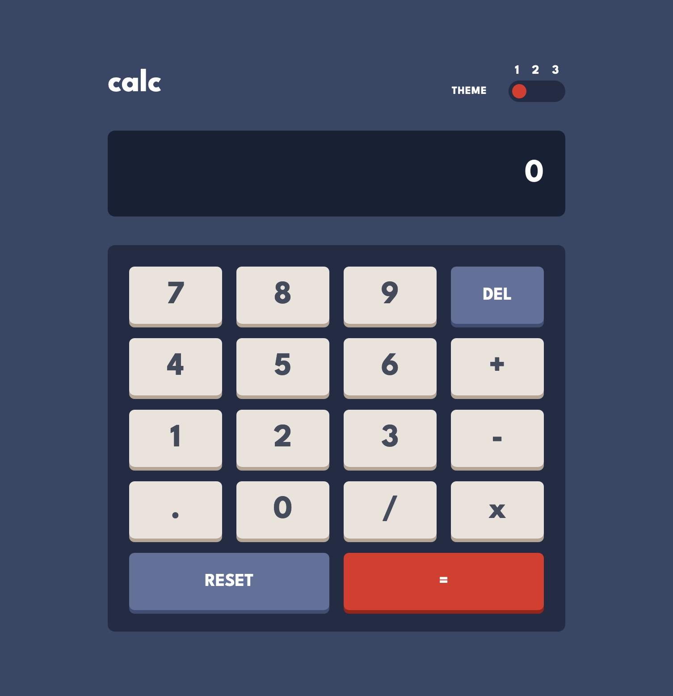

# Frontend Mentor - Calculator app solution

This is a solution to the [Calculator app challenge on Frontend Mentor](https://www.frontendmentor.io/challenges/calculator-app-9lteq5N29). Frontend Mentor challenges help you improve your coding skills by building realistic projects.

## Table of contents

- [Overview](#overview)
  - [The challenge](#the-challenge)
  - [Screenshot](#screenshot)
  - [Links](#links)
- [My process](#my-process)
  - [Built with](#built-with)
  - [Useful resources](#useful-resources)
- [Author](#author)

## Overview

### The challenge

Users should be able to:

- See the size of the elements adjust based on their device's screen size
- Perform mathmatical operations like addition, subtraction, multiplication, and division
- Adjust the color theme based on their preference
- **Bonus**: Have their initial theme preference checked using `prefers-color-scheme` and have any additional changes saved in the browser

### Screenshot

### Links

- Solution URL: [frontendmentor-challenges/17-calculator-app](https://github.com/david-tejada/frontendmentor-challenges/tree/main/17-calculator-app)
- Live Site URL: [Frontend Mentor | Calculator app](https://funny-stroopwafel-fd6f5d.netlify.app/)

## My process

### Built with

- Semantic HTML5 markup
- CSS custom properties
- Flexbox
- CSS Grid
- Mobile-first workflow
- [React](https://reactjs.org/) - JS library
- [Tailwind CSS](https://tailwindcss.com/)
- [Vite](https://vitejs.dev/)
- [Vitest](https://vitest.dev/)
- [number-precision - npm](https://www.npmjs.com/package/number-precision)

### Useful resources

- [I WISH I Knew These Tailwind Tips Earlier - YouTube](https://www.youtube.com/watch?v=QBajvZaWLXs&t=19s)
- [You’re doing dark mode wrong! - YouTube](https://www.youtube.com/watch?v=WTchW0LdWL0)

## Author

- Frontend Mentor - [@david-tejada](https://www.frontendmentor.io/profile/david-tejada)
